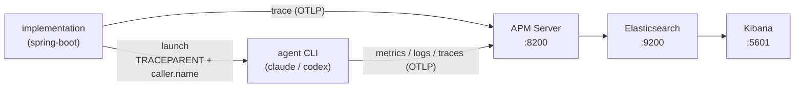

# agent-trace-handoff

Launch an AI coding agent (`claude -p`, `codex exec`) as a subprocess and observe it as part of
the launching application. Three parts: an **implementation** that launches the agent, the
**agent** emitting its own OpenTelemetry telemetry, and an **Elastic backend**
([`docker-compose.yml`](docker-compose.yml): Elasticsearch + Kibana + APM Server, 9.4.2)
receiving the implementation's trace and the agent's telemetry over OTLP.

The result — the implementation's root span with the agent's spans beneath it, in one trace:

## Trace Handoff

The implementation hands its trace context to the agent through the child process environment:

| Env var | Effect |
| --- | --- |
| `TRACEPARENT` | the agent's spans join the implementation's trace (same `trace.id`) |
| `OTEL_RESOURCE_ATTRIBUTES=caller.name=…` | every agent metric / log / span carries `labels.caller_name` |

Each agent's telemetry carries its own `service.name` (`claude-code`, `codex_cli_rs`); the
handoff does not change it. In the APM trace view the agent therefore appears as its own service,
its spans beneath the implementation's root span.

## Implementations

| Path | What |
| --- | --- |
| [`spring-boot/`](spring-boot/) | Spring Boot 4 one-shot launcher |

Usage — bringing up the backend and running the launcher — is in each implementation's README.

## Agent Configurations

The agents can emit their telemetry over OpenTelemetry; the feature is off by default and enabled
by a config file. This repository ships those configs at project scope, pointing every signal at
the bundled APM Server:

| Agent | File |
| --- | --- |
| Claude Code | [`.claude/settings.json`](.claude/settings.json) |
| Codex | [`.codex/config.toml`](.codex/config.toml) |

A launched agent reads its config, exports telemetry, and applies the Trace Handoff it received
in its environment to everything it emits. Each implementation points its agent at these configs.

> [!WARNING]
> Codex ignores a project-local `[otel]` config, so the implementations load
> [`.codex/config.toml`](.codex/config.toml) by pointing `CODEX_HOME` at the repository's
> `.codex/`. That also relocates Codex's login — run `codex login` once under that home, or copy
> `~/.codex/auth.json` into it.
