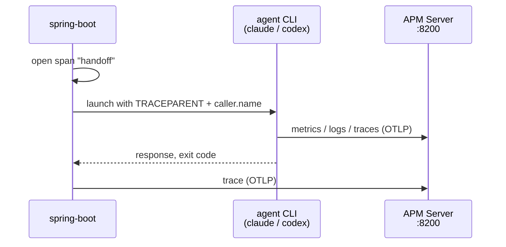
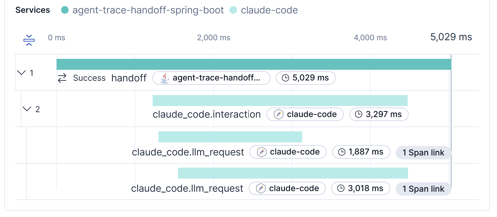

# spring-boot

A non-web Spring Boot 4 one-shot: boots, opens a span, launches the agent with the handoff env,
waits for it, exits. It exports its own trace over OTLP; no metrics, no logs.



## Trace Handoff

- opens a Micrometer span named `handoff` (sampled at `1.0`) and passes its W3C `traceparent` to
  the agent via `TRACEPARENT`
- passes `OTEL_RESOURCE_ATTRIBUTES=caller.name=<handoff.caller-name>`; it lands on every agent
  signal as `labels.caller_name`

## Prerequisites

- JDK 25
- the agent CLI logged in

## Run

```sh
git clone https://github.com/hainet50b/agent-trace-handoff.git
cd agent-trace-handoff
docker compose up -d
cd spring-boot
./mvnw spring-boot:run -D"spring-boot.run.arguments=--handoff.agent=claude"
```

The run prints output like:

```
launching claude in <repo root> with prompt "say hi in one word"
find this run in Elasticsearch: trace.id=<32hex>, labels.caller_name=<name>
claude responded: "hi"
claude exited with code 0 — its telemetry flushes on exit and joins trace.id=<32hex>
```

## Verify

Kibana APM: <http://localhost:5601/app/apm/services>. Open the `agent-trace-handoff-spring-boot`
service and its latest transaction — the trace view shows the implementation's root span with the
agent's spans beneath it. Discover finds the agent's signals by the printed `trace.id` /
`labels.caller_name`.



The implementation's root span and the agent's spans under one trace:

```sh
curl -s "http://localhost:9200/traces-apm*/_search" -H 'Content-Type: application/json' \
  --data '{"query":{"term":{"trace.id":"<traceId>"}}}'
```

Every agent signal tagged with the launching implementation:

```sh
curl -s "http://localhost:9200/logs-apm.app.claude_code*/_search" -H 'Content-Type: application/json' \
  --data '{"query":{"term":{"labels.caller_name":"<name>"}}}'
```

For `codex`, query `logs-apm.app.codex_*` instead.

## Configuration (`handoff.*`)

| Key | Default | Meaning |
| --- | --- | --- |
| `handoff.agent` | `claude` | agent to launch (`claude`, `codex`) |
| `handoff.caller-name` | `${spring.application.name}` | `caller.name` resource attribute (no spaces / `,` / `=`) |
| `handoff.prompt` | `say hi in one word` | prompt handed to the agent |

Override at launch:

```sh
./mvnw spring-boot:run -D"spring-boot.run.arguments=--handoff.caller-name=checkout-svc --handoff.prompt=list the files here"
```

## Implementation Guide

The handoff lives in `AgentTraceHandoffRunner`. It opens a span, serializes it to a W3C
`traceparent`, and puts the per-agent env on the child process.

Opening the span:

```java
Span span = tracer.nextSpan().name("handoff").start();
```

Serializing it to a W3C `traceparent`:

```java
private String traceparent(Span span) {
    Map<String, String> carrier = new HashMap<>();
    propagator.inject(span.context(), carrier, Map::put);
    return carrier.get("traceparent");
}
```

Putting the per-agent env on the child process:

```java
processBuilder.environment().putAll(agent.env(new TraceHandoff(
        traceparent(span),
        properties.callerName()
)));
```

The per-agent differences live in the `Agent` enum. Each constant answers two questions: the
command line, and the env to hand it. `claude -p` reads `TRACEPARENT` and
`OTEL_RESOURCE_ATTRIBUTES`:

```java
CLAUDE {
    @Override
    List<String> argv(String prompt) {
        return List.of("claude", "-p", prompt);
    }

    @Override
    Map<String, String> env(TraceHandoff handoff) {
        return Map.of(
                "TRACEPARENT", handoff.traceparent(),
                "OTEL_RESOURCE_ATTRIBUTES", "caller.name=" + handoff.callerName()
        );
    }
}
```

`codex exec` reads `OTEL_RESOURCE_ATTRIBUTES` but not `TRACEPARENT`; it also needs `CODEX_HOME`
pointing at the repository's `.codex/`, and on Windows it launches through `cmd /c` (a
`codex.cmd` shim is invisible to Java's `CreateProcess`):

```java
CODEX {
    @Override
    List<String> argv(String prompt) {
        if (System.getProperty("os.name").startsWith("Windows")) {
            return List.of("cmd", "/c", "codex", "exec", prompt);
        }
        return List.of("codex", "exec", prompt);
    }

    @Override
    Map<String, String> env(TraceHandoff handoff) {
        return Map.of(
                "OTEL_RESOURCE_ATTRIBUTES", "caller.name=" + handoff.callerName(),
                "CODEX_HOME", Path.of("../.codex").toAbsolutePath().normalize().toString()
        );
    }
}
```
